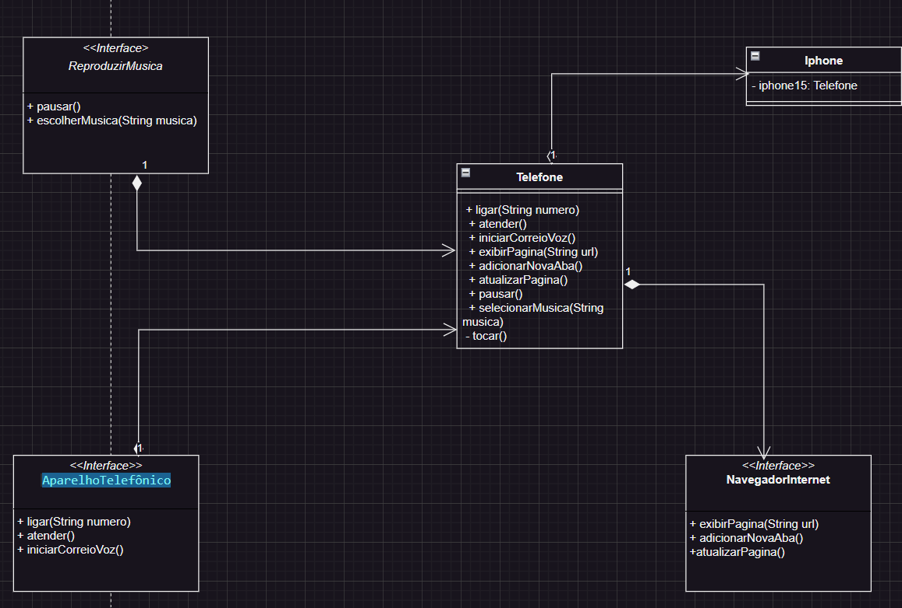

# SmartphoneSimulator
Descrição:

O projeto **SmartphoneSimulator** é uma demonstração de um smartphone virtual, implementado em Java. Ele apresenta uma simulação das funcionalidades de um smartphone moderno, incluindo chamadas telefônicas, navegação na internet e reprodução de música.

Este projeto utiliza interfaces para representar diferentes aspectos do funcionamento de um smartphone, como a capacidade de fazer chamadas, navegar na internet e reproduzir músicas. A classe `Telefone` implementa essas interfaces e fornece uma implementação básica de cada funcionalidade.

A classe `Iphone` contém um método `main` que instancia um objeto `Telefone` e demonstra as diversas funcionalidades disponíveis, como fazer uma chamada telefônica, navegar em páginas da web e reproduzir músicas.

